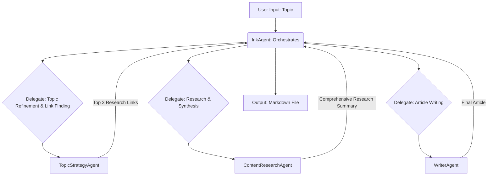

# inkAgent: Automated Thought-Leadership Article Generation

**inkAgent** is an AI-powered application, built with the CrewAI framework, that automates the creation of high-quality, two-page thought-leadership articles. Provide a topic, and inkAgent will handle the research, content synthesis, and writing process from start to finish.

## Features

-   **Automated Content Creation:** Generates a complete two-page article from a single topic.
-   **Multi-Agent System:** Utilizes a team of specialized AI agents for a structured and robust workflow.
-   **Web Research:** Identifies relevant and authoritative online sources for the given topic.
-   **Content Synthesis:** Scrapes and consolidates information from web pages to create a comprehensive knowledge base.
-   **Expert Writing:** Produces a well-structured and insightful article suitable for both technical and business audiences.
-   **Extensible:** Built with a modular structure that is easy to customize and extend.

## The Workflow

The application follows a sequential process orchestrated by a master agent:

1.  **Topic Refinement:** The `TopicStrategyAgent` refines the user-provided topic for optimal web search results and identifies the top 3 most relevant and authoritative online sources.
2.  **Content Research:** The `ContentResearchAgent` scrapes the content from the provided links and creates a detailed research summary.
3.  **Article Writing:** The `WriterAgent` uses the research summary to write a compelling, two-page thought-leadership article.
4.  **Final Output:** The completed article is saved as a Markdown file.

## inkAgent: Multi-Agent Orchestration Flow

The core of `inkAgent`'s intelligence lies in its CrewAI-powered multi-agent system. The `InkAgent` (Master Agent), configured with `allow_delegation=True`, orchestrates the entire process by delegating tasks to specialized agents and managing the flow of information.




## The AI Crew

-   **`InkAgent` (Master Agent):** An expert project manager that orchestrates the entire workflow, delegating tasks to the specialist agents.
-   **`TopicStrategyAgent`:** A content strategist that refines topics and finds the best online sources.
-   **`ContentResearchAgent`:** A meticulous researcher who gathers and synthesizes information from web pages.
-   **`WriterAgent`:** An industry expert writer who crafts the final article.

## Getting Started

### Prerequisites

-   Python 3.8+
-   An API key from [Groq](https://console.groq.com/keys)
-   An API key from [Serper](https://serper.dev/) for Google Search results.
-   (Optional) An API key from [LangSmith](https://www.langchain.com/langsmith) for tracing and debugging.

### Installation

1.  **Clone the repository:**
    ```bash
    git clone https://github.com/your-username/inkAgent.git
    cd inkAgent
    ```

2.  **Create a virtual environment and install dependencies:**
    ```bash
    python -m venv .venv
    source .venv/bin/activate
    pip install -r requirements.txt
    ```

### Configuration

Create a `.env` file in the root of the project and add your API keys:

```
GROQ_API_KEY="YOUR_GROQ_API_KEY"
SERPER_API_KEY="YOUR_SERPER_API_KEY"

# Optional LangSmith configuration
LANGSMITH_API_KEY="YOUR_LANGSMITH_API_KEY"
LANGSMITH_TRACING="true"
LANGSMITH_PROJECT="inkAgent-App"
```

## Usage

Run the application from the command line:

```bash
python main.py
```

You will be prompted to enter a topic for the article. The application will then execute the workflow and save the final article as a Markdown file in the project's root directory.

## Project Structure

```
inkAgent/
├── .env
├── config/
│   ├── agents.yaml       # Agent definitions
│   └── tasks.yaml        # Task definitions
├── tools/
│   ├── __init__.py
│   └── website_search_tool.py # Custom tool for web scraping
├── main.py               # Main application entry point
└── requirements.txt      # Python dependencies
```
